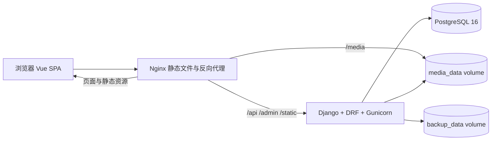
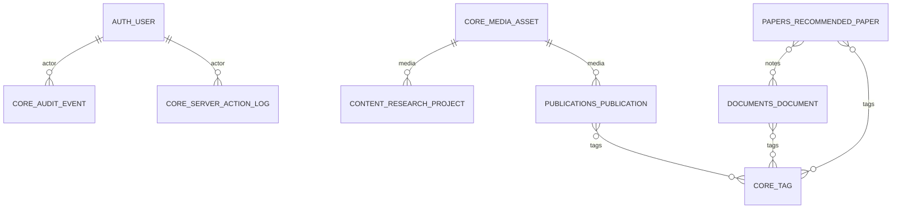

# Syins Research OS 后端与数据库设计

> 本文档基于当前仓库中的 Django、DRF、PostgreSQL 和 Vue 前端实现编写。
> “当前实现”描述已经存在并经过测试的代码；“后续建议”是为了支持未来迭代，不代表已经开放的功能。

## 1. 设计目标

Syins Research OS 同时承担两个边界清晰的职责：

1. 对外提供研究者主页，包括个人资料、研究方向、精选项目、论文和公开 Notes。
2. 对内提供个人研究工作台，包括论文记忆、Markdown 文档、媒体资产、服务器清单和设置。

后端设计遵循以下原则：

- 按稳定业务域拆分 Django app，避免把所有数据塞进一个 JSON 文档。
- 公开读取、私有工作台和基础设施操作在权限层显式分离。
- 浏览器使用同源 Session + CSRF，不在前端保存长期 API token。
- 数据库 schema 只通过 Django migration 演进；应用容器可以替换，数据 volume 不替换。
- 服务器动作必须是白名单动作，不提供任意 shell 执行接口。
- 现在保持单用户、单实例和简单部署；未来扩展时尽量保持现有 API 和实体稳定。

## 2. 系统架构



### 2.1 运行组件

| 组件 | 当前职责 | 持久化方式 |
|---|---|---|
| `frontend` | 构建后的 Vue SPA，由 Nginx 提供；代理 API、Admin、静态资源 | 镜像层；读取共享 media volume |
| `backend` | Django、DRF、Gunicorn；启动时执行 migration、collectstatic、可选 seed | 不在容器本地保存业务数据 |
| `db` | PostgreSQL 16，保存结构化业务数据 | `postgres_data` |
| media storage | 上传的图片、视频、interactive 文件 | `media_data` |
| backup storage | 容器内预留的备份目录；备份脚本实际把导出文件写到宿主机 `data/backups/` | `backup_data` volume 与宿主机备份目录目前是两套存储，不能混为一处 |

本地开发在未设置 `DATABASE_URL` 时使用 SQLite；Docker 部署默认使用 PostgreSQL。两种数据库都使用同一套 Django migration 和测试代码。

### 2.2 启动与更新顺序

后端容器入口脚本的顺序是：

1. `python manage.py migrate --noinput`
2. `python manage.py collectstatic --noinput`
3. `SEED_DEMO=true` 时执行幂等的 `seed_demo`
4. 启动 Gunicorn

升级时建议执行：

```text
备份数据库和媒体
    -> 拉取新代码
    -> docker compose build --pull
    -> docker compose up -d
    -> 容器启动时执行增量 migration
    -> 检查服务和 API
```

migration 必须向前兼容已有数据。需要删除或重命名字段时，优先采用“新增字段 → 数据迁移 → 应用切换 → 后续版本删除旧字段”的多版本流程。

## 3. Django 后端分层

每个业务 app 采用相同的职责边界：

- `models.py`：数据结构、字段级不变量和排序规则。
- `serializers.py`：数据库字段与 API camelCase 契约之间的转换、输入校验。
- `views.py`：HTTP、权限、查询过滤和事务边界。
- `services.py`：需要独立测试或包含业务动作的领域逻辑。
- `urls.py`：路由注册。
- `migrations/`：数据库 schema 变更。

### 3.1 App 与业务边界

| App | 主要职责 | 核心模型 | 访问边界 |
|---|---|---|---|
| `accounts` | 登录、登出、Session、CSRF 初始化、邮箱或用户名认证 | Django `User`、`Session` | Session 端点公开；写入需要登录 |
| `content` | 主页单例资料、当前研究、精选研究项目 | `SiteProfile`、`CurrentResearchItem`、`ResearchProject` | GET 公开；CMS 写入需要登录 |
| `publications` | 正式论文和预印本 | `Publication` | GET 公开；创建、修改、删除需要登录 |
| `documents` | Markdown 文档、可见性、精选和可恢复 Trash | `Document` | 公开文档可读；私有数据和写入需要登录 |
| `papers` | 推荐论文记忆、阅读状态、标签和文档关联 | `RecommendedPaper` | 全部需要登录 |
| `servers` | 服务器清单、资源快照和白名单动作 | `Server` | 全部需要登录 |
| `core` | 跨域基础设施 | `MediaAsset`、`Tag`、`WorkspaceSettings`、审计模型 | 媒体读取可公开；管理操作需要登录 |

`AuditEvent` 是通用审计模型的基础；当前服务器动作实际写入 `ServerActionLog`，后续可将所有重要写操作统一接入 `AuditEvent`。

## 4. 认证、权限与 API 契约

### 4.1 认证方式

- Django SessionAuthentication 是唯一 API 认证方式。
- 登录支持 `email` 或 `username`；认证后由 Django 设置 Session cookie。
- `session/` GET 会返回当前登录状态，并通过响应头和 cookie 提供 CSRF token。
- 所有浏览器写请求携带 `X-CSRFToken`。
- Session cookie 为 `HttpOnly`，`SameSite=Lax`；非 DEBUG 环境默认启用 Secure cookie。
- 前端不保存 JWT 或长期 API token。

这种方式适合当前 Nginx 与 Django 同源部署。未来若增加独立移动端、第三方客户端或多租户 API，再单独设计 token/OAuth 边界，不直接把两种认证方式混在现有 Session 端点中。

### 4.2 API 版本与响应约定

- 业务 API 前缀固定为 `/api/v1/`。
- JSON 字段使用前端约定的 camelCase，例如 `publishedAt`、`mediaAssetId`、`noteIds`。
- 列表默认使用 DRF 分页，默认 `PAGE_SIZE=50`。
- 列表支持 `search`、类型、状态、标签等轻量查询参数；前端同时兼容分页和非分页响应。
- API schema 为 `/api/schema/`，Swagger UI 为 `/api/docs/`。
- 典型错误：未登录 `401`、无权限 `403`、资源不存在 `404`、媒体仍被引用 `409`、尚未启用的远程动作 `501`。

### 4.3 权限矩阵

| 资源 | 匿名 GET | 登录 GET | 登录写入 | 备注 |
|---|---:|---:|---:|---|
| `/auth/session/` | 是 | 是 | - | 返回当前登录状态 |
| `/site/content/` | 是 | 是 | 是 | PUT/PATCH 是聚合更新 |
| `/research/*` | 是 | 是 | 当前只读 | 研究项目和当前研究列表 |
| `/publications/` | 是 | 是 | 是 | 当前 Publication 没有私有可见性 |
| `/docs/` | 公开文档 | 全部未归档文档 | 是 | `unlisted` 只能精确访问，不能出现在公开列表 |
| `/papers/` | 否 | 是 | 是 | 私人推荐论文 |
| `/settings/` | 否 | 是 | 是 | 工作台设置和备份 |
| `/tags/` | 否 | 是 | 标签重命名/删除 | 标签列表也属于工作台 |
| `/media/` | 单个文件可读 | 是 | 上传/删除 | 删除前检查业务引用 |
| `/servers/` | 否 | 是 | 是 | 包括状态刷新和动作日志 |

DRF 默认权限是 `AllowAny`，因此私有 ViewSet 必须显式声明 `IsAuthenticated` 或等价权限，新增接口时必须同时补充权限测试。

## 5. API 设计

### 5.1 认证

| 方法 | 路径 | 说明 |
|---|---|---|
| `GET` | `/api/v1/auth/session/` | 获取当前用户和 CSRF cookie |
| `POST` | `/api/v1/auth/login/` | 使用 `email` 或 `username` + `password` 登录 |
| `POST` | `/api/v1/auth/logout/` | 注销当前 Session |

### 5.2 内容与公开站点

| 方法 | 路径 | 说明 |
|---|---|---|
| `GET` | `/api/v1/site/content/` | 返回单例站点资料、精选项目和启用的当前研究 |
| `PUT/PATCH` | `/api/v1/site/content/` | 原子更新站点资料；传入列表时同步替换项目/研究项集合 |
| `GET` | `/api/v1/research/projects/` | 精选研究项目列表 |
| `GET` | `/api/v1/research/current/` | 当前研究列表 |
| `GET/POST/PATCH/DELETE` | `/api/v1/publications/` | 论文 CRUD；按 `slug` 读取 |
| `GET/POST/PATCH/DELETE` | `/api/v1/docs/` | 文档 CRUD；按 `slug` 读取 |
| `POST` | `/api/v1/docs/{slug}/trash/` | 移入 Trash |
| `POST` | `/api/v1/docs/{slug}/restore/` | 从 Trash 恢复 |

文档列表的语义如下：

- 匿名列表只返回 `visibility=public` 且未归档的文档。
- 匿名精确读取允许 `public` 和 `unlisted`，但不允许 `private`。
- 登录用户默认读取未归档数据，`?trash=1` 只读取 Trash，`?trash=all` 读取全部。
- 删除文档不是物理删除，而是设置 `trashed_at`。

### 5.3 私有研究工作台

| 方法 | 路径 | 说明 |
|---|---|---|
| `GET/POST/PATCH/DELETE` | `/api/v1/papers/` | 推荐论文 CRUD |
| `POST` | `/api/v1/papers/check/` | 以 DOI、arXiv ID 或标题检查重复 |
| `GET` | `/api/v1/papers/export/` | 导出 JSON 或 Markdown |
| `GET/PATCH/PUT` | `/api/v1/settings/` | 工作台设置 |
| `GET` | `/api/v1/settings/backup/` | 生成包含 JSON 和媒体文件的 ZIP 备份 |
| `GET` | `/api/v1/tags/` | 标签列表 |
| `POST` | `/api/v1/tags/rename/` | 合并、重命名或删除标签 |
| `GET/POST/DELETE` | `/api/v1/media/` | 媒体读取、上传和删除 |

推荐论文的 `noteIds` 是到 `Document` 的多对多关系。创建或更新标签时，API 接受字符串数组，后端负责规范化、去重和创建缺失标签。

### 5.4 服务器基础设施

| 方法 | 路径 | 说明 |
|---|---|---|
| `GET/POST/PATCH/DELETE` | `/api/v1/servers/` | 服务器清单 CRUD |
| `GET` | `/api/v1/servers/{id}/status/` | 查看当前快照 |
| `POST` | `/api/v1/servers/{id}/actions/` | 执行白名单动作 |
| `POST` | `/api/v1/servers/refresh/` | 刷新所有启用服务器的 mock 状态 |

当前允许动作集合为 `refresh_status`、`start_container`、`stop_container`、`restart_container` 和 `fetch_logs`。mock connector 只支持状态刷新；SSH、Docker Remote、3x-ui 等真实连接器尚未开放远程写操作。

## 6. 数据库设计

### 6.1 数据库约定

- 业务主键默认使用 Django `BigAutoField`，适合个人工作台长期累积记录。
- `MediaAsset` 和 `ResearchProject` 使用 UUID，避免上传资源和可公开项目 ID 过于可预测。
- 单例配置使用 `PositiveSmallIntegerField` 主键并固定为 `1`：`SiteProfile`、`WorkspaceSettings`。
- 时间统一以带时区的 UTC 存储；应用展示层按 `TIME_ZONE` 转换，默认是 `Asia/Shanghai`。
- 模型未显式声明 `db_table`，因此默认表名为 `<app_label>_<model_name>`。
- 当前没有多租户字段；所有业务记录属于同一个个人工作区。

### 6.2 Django 内置表

Django migration 还会创建以下平台表：

| 表 | 用途 |
|---|---|
| `auth_user` | 用户、密码哈希、staff/superuser 标记 |
| `auth_group`、`auth_user_groups`、`auth_user_user_permissions` | Django 权限组与用户权限 |
| `auth_permission`、`django_content_type` | Admin/权限元数据 |
| `django_session` | Session 登录状态 |
| `django_migrations` | 已应用 migration 记录 |
| `django_admin_log` | Django Admin 操作日志 |

当前使用 Django 默认 User 表，业务层通过 email-or-username backend 支持邮箱登录，但没有修改 User 的主键结构。

### 6.3 `content` 域

#### `content_siteprofile`

单例主页资料，主键固定为 `id=1`。

| 字段 | 类型/约束 | 说明 |
|---|---|---|
| `id` | `smallint` PK | 固定单例主键 |
| `name` | `varchar(120)` | 研究者名称 |
| `title` | `varchar(180)` | 职业/身份标题 |
| `location` | `varchar(120)` | 地点 |
| `email` | `varchar(254)` | 联系邮箱 |
| `headline`、`bio` | `text` | 首页简介 |
| `research_directions` | `text` | 研究方向 |
| `featured_research_intro` | `text` | 精选研究简介 |
| `*_heading`、`*_description` | `varchar/text` | 各站点区块标题和描述 |
| `scholar_url`、`github_url`、`cv_url` | URL | 外部链接 |
| `updated_at` | datetime | 自动更新时间 |

#### `content_currentresearchitem`

当前研究问题的排序列表。`SiteProfile` 与该表没有数据库外键，而是由 `/site/content/` 作为一个内容聚合返回。

| 字段 | 类型/约束 | 说明 |
|---|---|---|
| `id` | `bigint` PK | 自增主键 |
| `order` | unsigned int | 展示顺序 |
| `number` | `varchar(12)` | 展示编号，如 `01` |
| `title` | `varchar(240)` | 研究项标题 |
| `text`、`question`、`method` | text | 摘要、研究问题、方法 |
| `status` | `varchar(80)` | 展示状态 |
| `updated_label` | `varchar(120)` | 展示用更新时间文案 |
| `enabled` | boolean | 是否出现在公开站点 |

默认排序为 `order ASC, id ASC`。

#### `content_researchproject`

精选研究项目，使用 UUID 主键。

| 字段 | 类型/约束 | 说明 |
|---|---|---|
| `id` | UUID PK | 项目标识 |
| `order` | unsigned int | 展示顺序 |
| `title` | `varchar(240)` | 项目名称 |
| `motivation`、`approach` | text | 动机和方法 |
| `status` | `varchar(80)` | 项目状态 |
| `media_type` | `varchar(20)` | 媒体类型 |
| `media_asset_id` | nullable FK -> `core_mediaasset` | 上传媒体，可置空 |
| `media_url`、`media_alt`、`caption` | text/varchar | 外部媒体、替代文本、说明 |
| `links` | JSON array | 项目、论文、代码链接 |
| `updated_at` | datetime | 自动更新时间 |

媒体外键使用 `SET NULL`，删除媒体不会级联删除项目。

### 6.4 `publications` 域

#### `publications_publication`

保存已发表论文和预印本的展示及索引元数据。

| 字段 | 类型/约束 | 说明 |
|---|---|---|
| `id` | `bigint` PK | 自增主键 |
| `slug` | `varchar(260)` UNIQUE | URL 标识，自动生成并保证唯一 |
| `title` | `varchar(300)` | 标题 |
| `authors` | text | 作者展示文本 |
| `venue`、`venue_short` | `varchar` | 会议/期刊及简称 |
| `year` | unsigned smallint | 发表年份 |
| `type` | `varchar(20)` | `Conference`、`Journal`、`Preprint` |
| `motivation`、`approach`、`abstract` | text | 研究说明 |
| `paper_url`、`code_url`、`project_url` | URL | 外部链接 |
| `bibtex` | text | BibTeX |
| `featured` | boolean | 是否精选 |
| `media_type`、`media_url`、`media_alt`、`caption` | text/varchar | 展示媒体信息 |
| `media_asset_id` | nullable FK -> `core_mediaasset` | 上传媒体 |
| `created_at`、`updated_at` | datetime | 生命周期时间 |

默认排序是 `year DESC, id DESC`。Publication 与 Tag 是多对多关系，连接表为 Django 自动生成的 `publications_publication_tags`。

### 6.5 `documents` 域

#### `documents_document`

Markdown 文档是公开 Notes 和私有研究笔记的统一实体。

| 字段 | 类型/约束 | 说明 |
|---|---|---|
| `id` | `bigint` PK | 自增主键 |
| `slug` | `varchar(260)` UNIQUE | 精确访问标识 |
| `title` | `varchar(300)` | 标题 |
| `summary`、`excerpt`、`content` | text | 摘要、列表摘要、Markdown 正文 |
| `kind` | `varchar(30)` | Research Note、Essay、Guide、Reference |
| `published_at` | nullable date | 发布日期；为空时展示为 Draft |
| `reading_time` | `varchar(60)` | 展示用阅读时间 |
| `visibility` | `varchar(12)` | `private`、`public`、`unlisted` |
| `featured` | boolean | 是否精选 |
| `trashed_at` | nullable datetime | 非空表示进入 Trash |
| `created_at`、`updated_at` | datetime | 生命周期时间 |

文档与 Tag 的连接表为 `documents_document_tags`。文档 Trash 是软删除：恢复时清空 `trashed_at`，不会丢失正文和关系。

### 6.6 `papers` 域

#### `papers_recommendedpaper`

保存私人推荐论文和阅读状态。

| 字段 | 类型/约束 | 说明 |
|---|---|---|
| `id` | `bigint` PK | 自增主键 |
| `title` | `varchar(320)` | 论文标题 |
| `authors` | text | 作者 |
| `venue` | `varchar(240)` | 来源 |
| `year` | unsigned smallint | 年份 |
| `topic` | `varchar(180)` | 主题 |
| `status` | `varchar(20)` | recommended/to_read/reading/read/ignored/important |
| `recommended_at` | date | 加入推荐列表日期 |
| `reason`、`abstract` | text | 推荐理由和摘要 |
| `rating` | nullable unsigned smallint | 个人评分 |
| `doi` | `varchar(180)` | DOI，非空时唯一 |
| `arxiv_id` | `varchar(120)` | arXiv ID，非空时唯一 |
| `paper_url` | URL | 论文链接 |
| `created_at`、`updated_at` | datetime | 生命周期时间 |

当前有两个条件唯一约束：

- `doi != ''` 时，`doi` 唯一。
- `arxiv_id != ''` 时，`arxiv_id` 唯一。

这样允许未知标识为空，但可以阻止相同 DOI 或 arXiv ID 重复录入。Paper 与 Tag 的连接表为 `papers_recommendedpaper_tags`；Paper 与 Document 的连接表为 `papers_recommendedpaper_notes`。

### 6.7 `servers` 域

#### `servers_server`

保存服务器清单和最近一次资源快照。资源快照采用 JSON，是为了允许不同机器报告不同维度而不频繁改表。

| 字段 | 类型/约束 | 说明 |
|---|---|---|
| `id` | `bigint` PK | 服务器标识 |
| `name` | `varchar(120)` | 显示名称 |
| `hostname` | `varchar(180)` | 主机名 |
| `ip` | nullable IP | IPv4/IPv6 |
| `description`、`location`、`os` | text/varchar | 描述、位置、系统 |
| `status` | `varchar(12)` | online/offline/warning |
| `provider` | `varchar(12)` | mock/ssh/xui |
| `last_seen` | nullable datetime | 最近一次成功刷新 |
| `uptime` | `varchar(80)` | 展示用运行时长 |
| `capabilities` | JSON array | 能力标签，如 SSH、Docker、NVIDIA_GPU |
| `cpu` | float | CPU 展示数值 |
| `memory`、`disk` | JSON object | 使用量/总量等资源快照 |
| `gpus` | JSON array | GPU 快照 |
| `containers` | unsigned int | 容器数量 |
| `connector_config` | JSON object | connector 配置；当前不由 API serializer 返回 |
| `enabled` | boolean | 是否参与批量刷新 |
| `created_at`、`updated_at` | datetime | 生命周期时间 |

当前 `connector_config` 没有加密层，因此在启用真实 SSH 或 3x-ui connector 前，不应把私钥、密码或 token 明文放入该字段。正式接入时应使用外部 secret manager、加密字段或至少独立的密钥管理方案。

### 6.8 `core` 域

#### `core_tag`

| 字段 | 类型/约束 | 说明 |
|---|---|---|
| `id` | `bigint` PK | 标签 ID |
| `name` | `varchar(80)` UNIQUE | 规范化后的展示名称 |
| `slug` | `varchar(90)` UNIQUE | `slugify(name)` |
| `created_at` | datetime | 创建时间 |

标签写入会压缩空白、去除首尾空格，并在 API 层按大小写不敏感规则去重。标签重命名会迁移 Publication、Document、RecommendedPaper 的连接关系。

#### `core_mediaasset`

| 字段 | 类型/约束 | 说明 |
|---|---|---|
| `id` | UUID PK | 资源标识 |
| `original_name` | `varchar(255)` | 原始文件名 |
| `kind` | `varchar(20)` | image/video/interactive |
| `content_type` | `varchar(150)` | 上传 MIME 类型 |
| `size` | unsigned bigint | 文件大小 |
| `checksum` | `varchar(64)` | SHA-256 |
| `source_file` | FileField | 相对路径 `assets/<uuid>/<filename>` |
| `created_at`、`updated_at` | datetime | 生命周期时间 |

当前允许的文件大小上限为 25 MB，扩展名白名单包括图片、`mp4/webm` 和 `html/htm/vue/zip` interactive 文件。删除前会检查 `ResearchProject` 和 `Publication` 的外键引用；仍被引用时返回 `409`。

#### `core_workspacesettings`

工作台单例配置，主键固定为 `id=1`。

| 字段 | 类型/约束 | 说明 |
|---|---|---|
| `id` | `smallint` PK | 固定单例主键 |
| `default_note_visibility` | `varchar(12)` | 新建文档默认可见性 |
| `default_note_kind` | `varchar(30)` | 新建文档默认类型 |
| `page_size` | unsigned smallint | 工作台分页大小 |
| `site_title` | `varchar(120)` | 工作台标题 |
| `updated_at` | datetime | 自动更新时间 |

#### `core_auditevent`

| 字段 | 类型/约束 | 说明 |
|---|---|---|
| `id` | `bigint` PK | 事件 ID |
| `actor_id` | nullable FK -> `auth_user` | 操作者，删除用户后置空 |
| `action` | `varchar(120)` | 动作名称 |
| `resource_type`、`resource_id` | varchar | 资源定位 |
| `metadata` | JSON object | 额外上下文 |
| `created_at` | datetime | 事件时间 |

#### `core_serveractionlog`

| 字段 | 类型/约束 | 说明 |
|---|---|---|
| `id` | `bigint` PK | 日志 ID |
| `server_id` | unsigned bigint | 当前为逻辑引用，不设置数据库 FK |
| `action` | `varchar(80)` | 请求的白名单动作 |
| `accepted` | boolean | 是否被 connector 接受 |
| `message` | text | 结果说明 |
| `actor_id` | nullable FK -> `auth_user` | 操作者 |
| `created_at` | datetime | 事件时间 |

`server_id` 当前不设 FK 是为了让服务器删除后仍能保留动作历史；后续可增加快照字段，或改为独立的不可变审计资源模型。

## 7. 关系模型



补充说明：

- `SiteProfile`、`WorkspaceSettings` 是单例表，不依赖用户外键。
- `CurrentResearchItem` 与 `ResearchProject` 通过内容聚合接口归属于主页，但当前没有直接的 `SiteProfile` 外键。
- `Publication`、`Document`、`RecommendedPaper` 与 Tag 是多对多关系，Django 自动维护连接表。
- `ResearchProject` 和 `Publication` 对 `MediaAsset` 使用可空外键 + `SET NULL`。
- `ServerActionLog.server_id` 是逻辑引用，不能依赖数据库级级联。

## 8. 一致性、事务与删除策略

### 8.1 事务

- `PUT/PATCH /site/content/` 使用 `transaction.atomic()`，站点资料、精选项目和当前研究项要么一起成功，要么一起回滚。
- `seed_demo` 使用事务，并且只通过 `get_or_create` 补齐缺失记录，不覆盖用户已经编辑的数据。
- 标签写入、标签合并和多对多集合更新由 serializer/service 统一处理。
- 服务器动作先执行白名单判断，再写入 `ServerActionLog`；无论动作被接受还是拒绝，都保留结果记录。

### 8.2 删除策略

| 数据 | 策略 |
|---|---|
| Document | 软删除，使用 `trashed_at`，可恢复 |
| MediaAsset | 物理删除，但必须先通过业务引用检查，同时删除 storage 文件 |
| ResearchProject/Publication -> MediaAsset | `SET NULL`，不级联删除业务实体 |
| User -> AuditEvent/ServerActionLog | `SET NULL`，保留历史事件 |
| Tag | 删除前移除关系；重命名时合并关系 |
| Server | 当前可以删除；动作日志保留逻辑 `server_id` |

## 9. 索引与查询策略

当前依赖 Django 自动创建的主键、唯一键、外键和条件唯一约束索引，适合个人研究工作台规模。主要查询通过 ORM 完成：

- Publication：标题、作者、摘要 `icontains`，以及类型、标签过滤。
- Document：标题、摘要、正文搜索，以及可见性、类型、标签、Trash 过滤。
- RecommendedPaper：标题、作者、推荐理由搜索，以及状态、标签过滤。
- 业务列表使用模型 `Meta.ordering` 提供稳定排序。

当前没有为全文搜索和组合过滤额外建立 PostgreSQL 索引。数据量扩大后，建议按真实查询耗时增加 migration，而不是提前引入搜索服务：

1. `Document(visibility, trashed_at, published_at)` 组合索引。
2. `CurrentResearchItem(enabled, order)` 组合索引。
3. `Server(enabled, provider, status)` 组合索引。
4. PostgreSQL 全文搜索或 trigram index，用于标题、作者、摘要和正文。
5. 只有在跨资源全文检索成为主要功能时，再考虑独立搜索引擎。

## 10. 备份、恢复与数据迁移

### 10.1 当前备份内容

`GET /api/v1/settings/backup/` 生成 ZIP：

- `research-os.json`：站点资料、研究项目、当前研究、Publication、Document、Paper、Server、Settings。
- `media/<uuid>/<filename>`：所有已保存媒体文件。

宿主机脚本 `scripts/backup.sh` 另外生成：

- PostgreSQL `pg_dump` 文件。
- media volume 的 `tar.gz` 快照。

数据库备份和媒体备份必须成对保存，不能只恢复数据库而丢失媒体文件。备份应复制到 Docker 主机以外的位置，并定期执行恢复演练。

### 10.2 恢复边界

当前实现已经提供导出，但没有自动导入/恢复 API。恢复建议优先在临时环境进行：

1. 恢复 PostgreSQL dump。
2. 恢复 media archive 到 `media_data`。
3. 运行 migration 和 `manage.py check`。
4. 检查 API、媒体 URL 和关键关联。
5. 再切换到正式环境。

后续如增加导入功能，应采用临时表/校验阶段/正式提交三步流程，避免上传一个损坏的 ZIP 就覆盖现有工作区。

## 11. 安全设计

- 生产环境通过 `DJANGO_SECRET_KEY`、`ALLOWED_HOSTS`、`CSRF_TRUSTED_ORIGINS` 和 HTTPS 配置安全边界。
- 密码只由 Django 保存哈希；不要把密码写入 seed 数据或提交到仓库。
- Session 和 CSRF cookie 在非 DEBUG 环境默认 Secure；反向代理通过 `X-Forwarded-Proto` 识别 HTTPS。
- 媒体上传有大小和扩展名白名单；文件名会被清理并放到 UUID 目录。
- interactive 内容只在浏览器 sandbox iframe 中加载，不执行 npm 安装、构建脚本或网络请求。
- 服务器 API 只接受固定动作，不接受任意命令或任意 connector 参数。
- `connector_config` 当前不会通过 Server serializer 返回；真实 connector 上线前必须解决密钥加密和轮换。
- 公开内容不能依赖前端隐藏来实现权限；公开/私有判断必须在 queryset 和 retrieve 层完成。

## 12. 可维护性与版本升级约定

### 12.1 新增业务模块

新增模块建议按以下顺序：

1. 明确实体、生命周期和公开/私有边界。
2. 在对应 app 的 `models.py` 增加模型和数据库约束。
3. 执行并审查 `makemigrations` 生成的 migration。
4. 增加 serializer 输入/输出契约。
5. 增加 viewset/service 和明确权限。
6. 增加 API 测试、迁移测试和关键失败路径测试。
7. 更新 OpenAPI、README 和本设计文档。

### 12.2 数据兼容原则

- 不复用已经含义改变的字段；语义改变应增加新字段。
- 外部标识优先使用稳定 `slug`、DOI、arXiv ID 或 UUID，不让前端依赖数据库自增 ID 的连续性。
- 输出字段可以保持 camelCase，数据库内部字段保持 snake_case。
- migration 必须可在已有生产数据上执行，不依赖清空数据库。
- seed 只能补齐缺失 demo 数据，不能覆盖真实编辑内容。

## 13. 后续建议（按优先级）

这些内容不是当前版本的必需项，应根据实际使用量逐步增加：

### P1：上线前建议

- 替换 `.env` 中的所有占位密钥和密码。
- 使用 HTTPS，并确认 Secure cookie、Host 和 CSRF origin 配置。
- 将数据库和媒体备份复制到独立机器并做一次恢复演练。
- 增加一个无需登录的 `/health/` 或 `/api/health/`，同时检查数据库连接，方便 Docker/反向代理探活。
- 为 `connector_config` 明确禁止保存明文密钥，或暂时完全禁用真实 connector。

### P2：使用规模增长后

- 为高频过滤增加组合索引，并根据 PostgreSQL `EXPLAIN` 调优。
- 增加统一写操作审计，把重要 CMS、媒体、标签和文档操作写入 `AuditEvent`。
- 为备份增加校验和、保留策略和自动恢复检查。
- 将服务器状态刷新、媒体处理和大文件导出移到后台任务队列；在此之前不必引入 Celery/Redis。

### P3：产品形态变化时

- 如果需要多人协作，再引入 Workspace/Organization、成员角色和资源归属字段。
- 如果需要草稿和审核，再给内容实体增加 revision/status，而不是破坏当前公开实体 API。
- 如果需要真实服务器控制，为每种 provider 定义独立 connector interface、超时、重试、权限和幂等规则。
- 如果需要外部客户端，再单独设计 token/OAuth 认证，不直接暴露 Session cookie 给第三方。

## 14. 当前验收命令

```bash
# 后端静态检查与 migration 检查
cd backend
python manage.py check
python manage.py makemigrations --check --dry-run
python manage.py test

# Docker 环境
cd ..
docker compose ps
docker compose logs --tail=100 backend
curl -I http://localhost:8080/
curl http://localhost:8080/api/v1/site/content/
```

本设计的核心判断是：当前数据模型已经足够支撑个人研究网站和工作台，不需要为了“前瞻性”提前引入多租户、微服务、消息队列或独立搜索集群。优先保持 migration、权限、备份和接口契约稳定，等真实数据量和协作需求出现后再增加基础设施。
